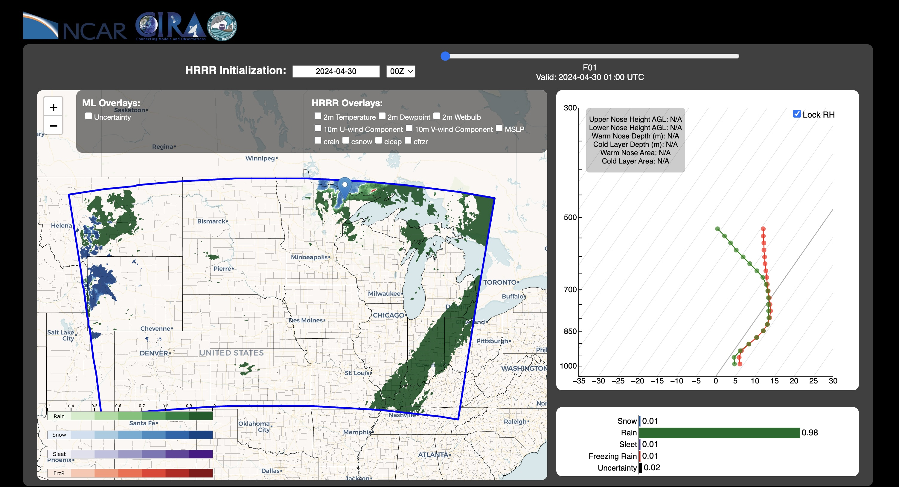

# Precipitation Type Interactive Visualization

https://www.precipitationtype.com

This repository contains a full-stack web application to visualize precipitation type probabilities. The frontend is built with **React**, and the backend is a **Flask** API served via **Gunicorn** behind an **Nginx** reverse proxy.

It is currently running on a t2.medium instance on the AWS CISL AI2ES Testbed.

## 🗂 Contents

Most of what you might want to change is in:  

**ptype/backend/app.py** (API call modifications)  
**ptype/frontend/src/pages/Home.js** (Main component/HTML modifications)  
**ptype/frontend/src/hooks/Hooks.js** (Main component/functionality modifications)  
**ptype/frontend/src/js/sounding.js** (Skew-T component modifications)  

A sample of netcdf and geojson files is included where appropriate.  

I haven't had time to clean up the scripts used to generate the netcdf and geojsons on Casper, but they are located in ptype/scripts.

<pre><code>ptype/
├── backend/
│   ├── app.py (Flask app)
│   ├── nn.json (nearest neighbors dictionary)
│   ├── ptype_model_20240909.keras (ptype model)
│   ├── ptype_scaler_20240909.json (ptype scaler)
│   └── data/ 
|       ├── MILES_ptype_hrrr_2024-04-30_0000_f01.nc (Sample raw data for skew-Ts)
|       └── ... (More raw data for skew-Ts)
├── frontend/
|   ├── package-lock.json
|   ├── package.json (Manifest)
│   ├── build/ (Production app)
|   |   └── .../ 
│   ├── public/
|   |   ├── bounds.geojson/ (Central region bounds)
|   |   ├── evi_frzr/ (Pre-generated evidential frzr layer geojsons)
|   |   |    ├── MILES_ptype_evi_2024-04-30_0000_f01_frzr.geojson (Sample evidential frzr layer geojson)
|   |   |    └── ... (More pre-generated evi_frzr geojsons)
|   |   └── .../ (More pre-generated geojsons for other variables)
│   └── src/
|       ├── index.js
|       ├── App.js (Router)
|       ├── assets/ (Static images/logos)
|       ├── css/ (CSS files)
|       ├── hooks/ (React App hooks)
|       |   └── Hooks.js (React App hooks)
|       ├── js/
|       |   ├── utils.js/ (Utility functions)
|       |   └── sounding.js (Sounding code)
|       ├── maps/
|       |   ├── gz_2010_us_050_00_20m.json (County borders)
|       |   └── usstates_wrap.json (US State borders)
|       └── pages/
|            └── Home.js (Main React App)
└── README.md
</code></pre>
